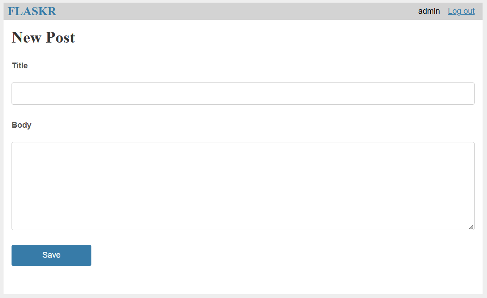

# FLASKR

Here is a brief overview of **flaskr** - a simple note app

### Features

- Registration, login
- CRUD functionality for posts
- In progress with some advanced features: Comment, View Profile, Emotion Reaction,...

### Demo

##### 1. Registration form


##### 2. Login form


##### 3. Post


##### 4. New post



##### 5. Edit


### Installation

1. Clone the repository
```bash
git clone https://github.com/huyvnnb/flaskr.
```

2. Navigate to the project directory:
```bash
cd flaskr
```

3. Install dependencies:
```bash
pip install -r requirements.txt
```

That's all. Thank you for reviewing my project. I am going to extend more feature
in the future. If you have any contribution, I am ready to collaborate and support to make the project better!

### Contact

- Gmail: huyqktk@gmail.com
- Linkedin: https://www.linkedin.com/in/huynguyenkma/
